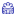
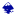
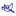

<h1> </h1>

I am former physicist that changed her carrier to become a Javascript developer. Currently I am in second half of full-stack web development course from [Digital Carrier Institute](https://digitalcareerinstitute.org/). This course is one year long, full certified and focus on MERN (MongoDB, ExpressJS, ReactJS and NodeJS) technology stack. During the course, I also work as a tutor for my fellow students - I help them to better understand the topic, with their problems and debugging.

 What I love at Web Development is the opportunity to combine logic and skills gained during my science carrier path with a creativity channeled till now just through my hobbies - photography (check my flickr account below) and calligraphy.

 As a former scientist, I like to understand things in details, therefore I regularly deepen and expand my knowledge by following [Frontend Masters](https://frontendmasters.com/dashboard/) courses and skills by practicing the coding and creating new things (recently, I started to learn Angular).To feed also my need for creativity, I dived deep inside of the SVG and its animation. I like to make animations subtle yet realistic (see my [icon easter eggs project](https://codepen.io/AliceRez/pen/abNpMoP)).
 
 Above that all, I am a big hat enthusiast - I have 13 in total and you will probably rarely see me without one of them 👒
 
**Are you interested? Get in touch with me, I am looking for job from the end of March 2021:**

<!--
**Alice-Rez/Alice-Rez** is a ✨ _special_ ✨ repository because its `README.md` (this file) appears on your GitHub profile.
<h1 align="center">Hi, I'm Alice!</h1>

Here are some ideas to get you started:

- 🔭 I’m currently working on ...
- 🌱 I’m currently learning ...
- 👯 I’m looking to collaborate on ...
- 🤔 I’m looking for help with ...
- 💬 Ask me about ...
- 📫 How to reach me: ...
- 😄 Pronouns: ...
- ⚡ Fun fact: ...
-->

 

 
 
 
 
 
 
 

**Tools and technologies I am familiar with (darker color = more experience with):** 

 
  
  
  
  
  
  

 

 

 
 

